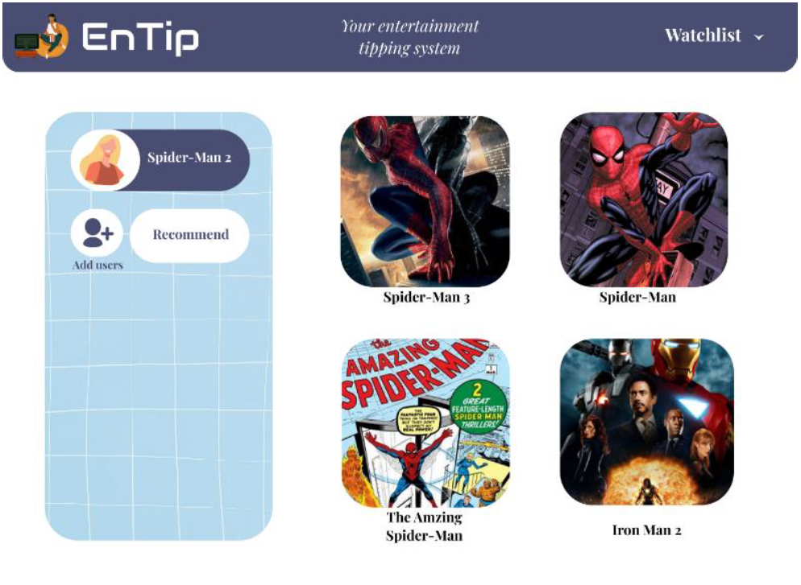
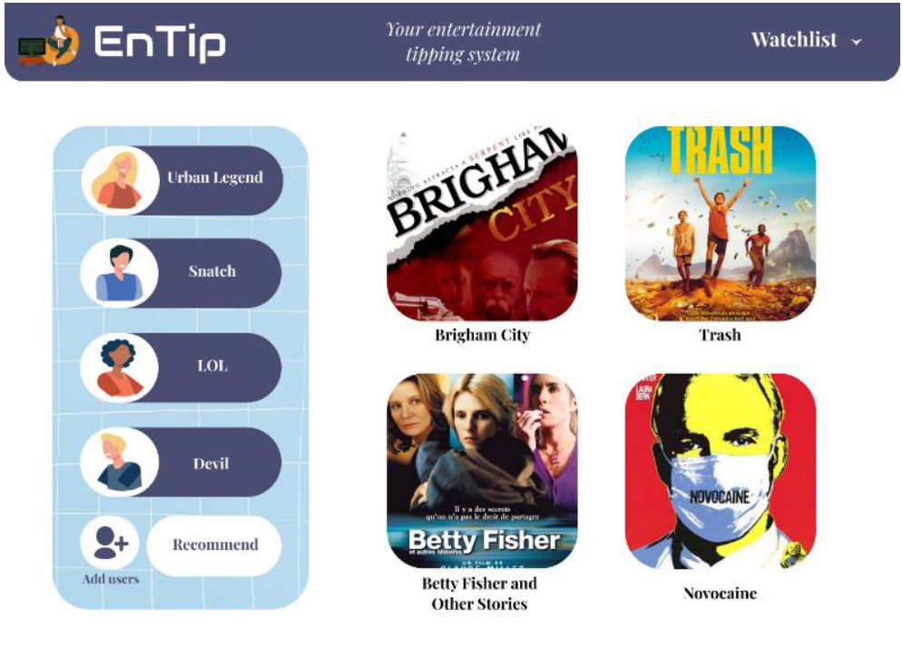
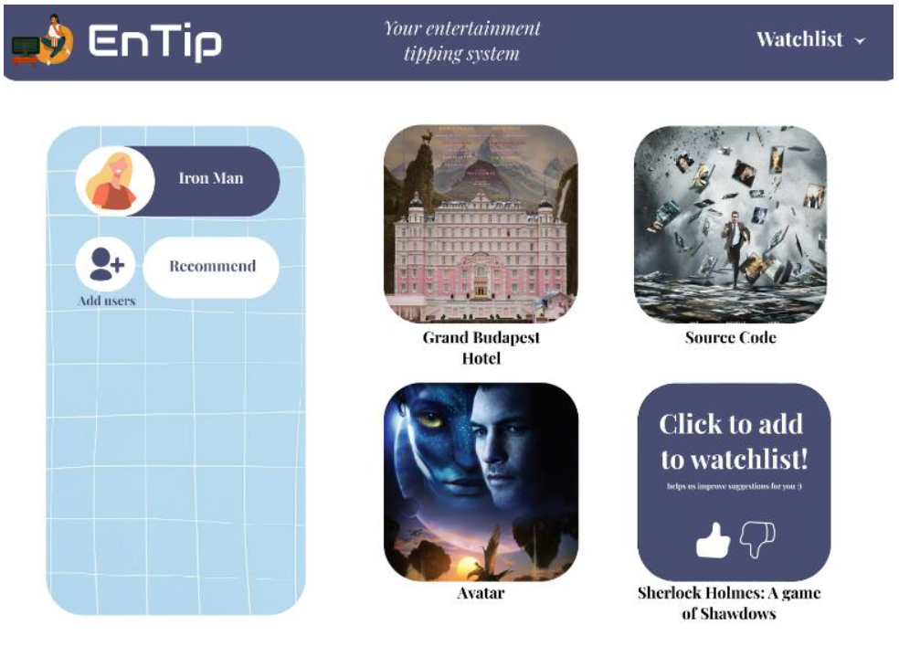
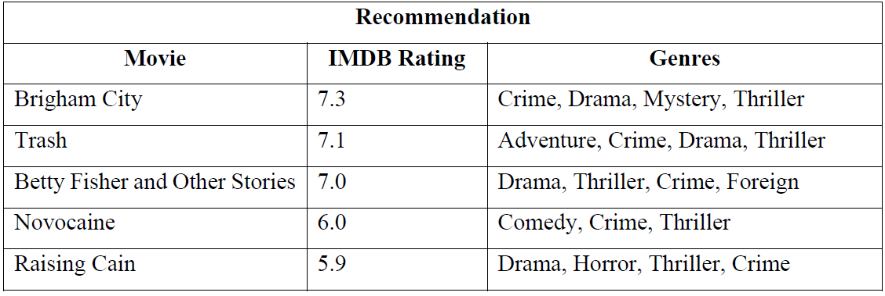
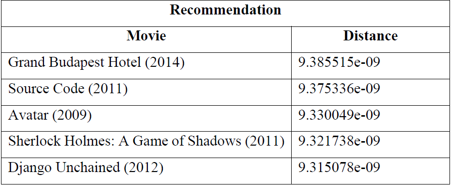

# Entip

Entertainment Recommendation System 

## Implementation
The recommendation engine was implemented using two methods: content-based filtering and collaborative based filtering. 
For content-based filtering, count vectorization and cosine similarity were performed on the dataset using tags, these tags were filtered from the dataframe and the bag of words method was used.  
Collaborative based filtering was implemented using k-NN (k -Nearest Neighbor) machine learning model where the user’s rating is the key attribute. 
For multiple movie/tv shows recommendation, the single recommendation engine was used as an input to an algorithm which compares their similarity with the user’s input to obtain the appropriate suggestions. 
  
Fig. Content based filtering  
  
Fig. Multiple user input recommendation system  
 
Fig. Collaborative based filtering 
 

## Test cases
Example test case for multi-user recommendation: 
User’s Input: 
1. Urban Legend - Genres: Horror, Thriller 
2. Snatch – Genres: Thriller, Crime 
3. LOL - Genres: Drama, Comedy, Romance 
4. Devil – Genres: Horror, Mystery, Thriller 
 
Fig. Output 

Example test case for KNN: 
User's Input: Iron Man 
 
Fig. Output 

## Future Scope/ Enhancement:
There is scope for enhancement in this project. Completing the development of the web-application and integrating the recommendation engine with it, is of major concern. Also, there is emphasis on broadening the fields of interest to documentaries as well as songs, and optimizing the time complexity of the algorithm for faster recommendations.